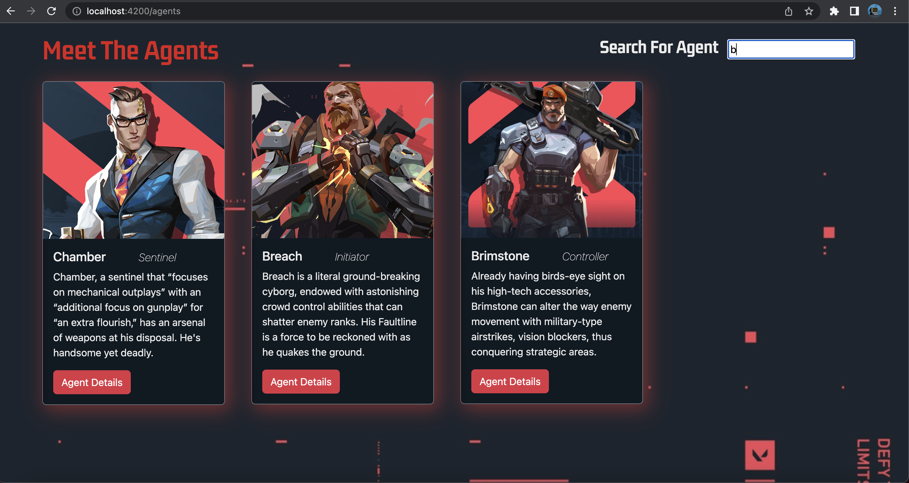

# ValorantAgentsGuide

## Overview

This Valorant Agent Guide was created using Angular. One of the first Angular applications I've ever created, which took about a week to create. In this app, users should be able to navigate through the agents list and click on the agent card image or details to get more details of a particular agent. Users can also filter agents by name with the provided search bar. Valorant is one of the fastest growing E-Sports games in the world, and what makes the game so unique is the agents and their backstory and abilities. 

### Screenshot

This is a screenshot of my app, and all the different components. 

### Built with

- Semantic HTML5 markup
- CSS custom properties
- Angular
- Typescript
- Bootstrap

### What I learned

I learned so much creating this project.. I spent maybe 50+ hours creating project, and there was not a day where I didn't enjoy what I was doing. A few things I learned was creating my own 'database' (which probably took the longest), making HTTP requests to that database, and how to route to the different components of this web app. There's too many things to name, but I feel a lot more comfortable with Angular but I also know I still have so much to learn!  

### Continued development

If you have any suggestions, please feel free to reach out to me on what improvements I can make.

### Useful resources

- [Boostrap Documentation](https://getbootstrap.com) - Read and used the Bootstrap documentation.
- [StackOverflow](https://www.stackoverflow.com) - Used this resource for a few questions.
- [Angular Documentation](https://angular.io/docs) - Relied heavily on the Angular documentation to build this app.

## Author

- Website - [Josh Villanueva](https://www.linkedin.com/in/patrick-villanueva-/)

